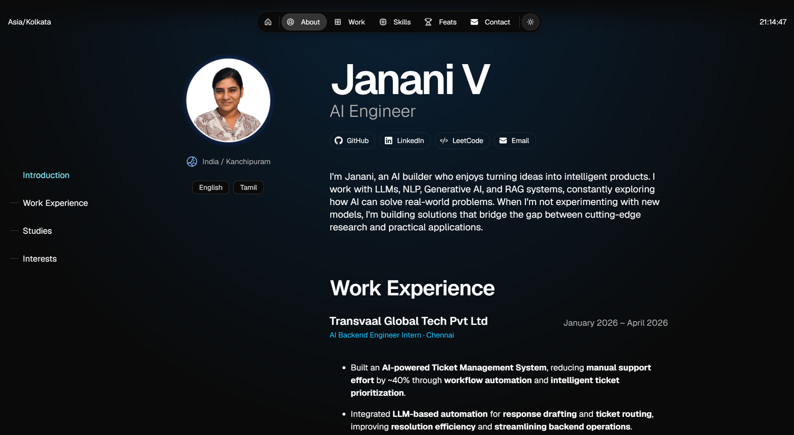

# Janani V Portfolio

Janani V Portfolio is a modern, responsive portfolio website showcasing my projects, publications, certifications, skills, and achievements in Artificial Intelligence, Machine Learning, Large Language Models (LLMs), IoT, and Software Development.

Visit the portfolio [here](https://jananiv-portfolio.vercel.app).

## About

Hi, I'm **Janani V**, an aspiring AI Engineer passionate about building intelligent systems and real-world AI applications.

## Features

* Responsive design for all devices
* AI & Machine Learning project showcase
* Publications and certifications section
* Skills and technology stack
* GitHub, LinkedIn, and LeetCode integration
* Contact and collaboration page

## Tech Stack

* Next.js
* TypeScript
* Once UI
* React
* Vercel

## Featured Projects

* BloodPrint ID – Fingerprint Correlation Analysis
* TicketFlow – Smart Ticket Management System
* Disease Prediction Platform
* Movie Recommendation System
* Stockd – Reservation Management System

## Connect

* GitHub: @Janviswa
* LinkedIn: Janani V
* Email: jananiviswa05@gmail.com

## Deployment

Hosted on Vercel and connected with GitHub for continuous deployment.

## Acknowledgements

This portfolio is built using the Magic Portfolio template by Once UI and customized by Janani V.

## License

Creative Commons Attribution-NonCommercial 4.0 International (CC BY-NC 4.0)
